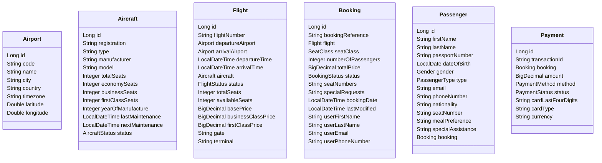

# Airline Reservation System Backend

A real-world, business-logic-rich Spring Boot backend for an Airline Reservation System. This project demonstrates a layered architecture with entities, repositories, services, and RESTful APIs for managing flights, bookings, payments, airports, aircraft, and passengers.

## Features
- Flight search, booking, and management
- Airport and aircraft management
- Booking and payment processing
- Business rules (seat availability, refund policy, pricing, etc.)
- Exception handling and validation
- H2 in-memory database for development

## Architecture
- **Spring Boot** (REST API)
- **Spring Data JPA** (Persistence)
- **H2 Database** (Development)

### Main Layers
- **Entity Layer:** JPA entities for Flight, Booking, Airport, Aircraft, Passenger, Payment
- **Repository Layer:** JPA repositories with custom queries
- **Service Layer:** Business logic, validation, and orchestration
- **Controller Layer:** REST endpoints for all operations

## UML Diagram



## Getting Started

### Prerequisites
- Java 17+
- Maven 3.8+

### Setup
1. **Clone the repository:**
   ```bash
   git clone <your-repo-url>
   cd <project-directory>
   ```
2. **Build the project:**
   ```bash
   mvn clean install
   ```
3. **Run the application:**
   ```bash
   mvn spring-boot:run
   ```
4. **Access H2 Console:**
   - URL: `http://localhost:8080/h2-console`
   - JDBC URL: `jdbc:h2:mem:airlinedb`
   - User: `sa`, Password: (leave blank or use your config)

## API Endpoints
- REST endpoints for flight, booking, payment, airport, and aircraft management are available under `/api/*`.

## Configuration
- All configuration is in `src/main/resources/application.properties`.

## Testing
- Run tests with:
  ```bash
  mvn test
  ```

## License
MIT

---

**UML Diagram**


